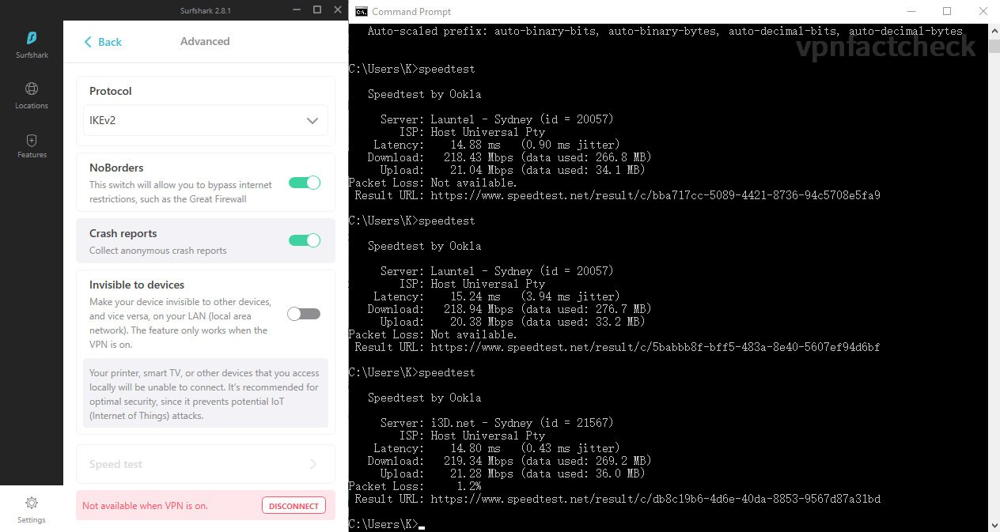
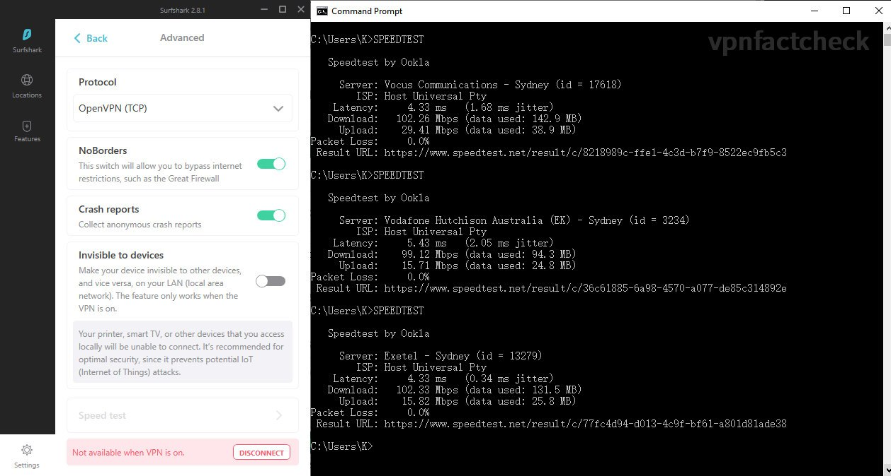
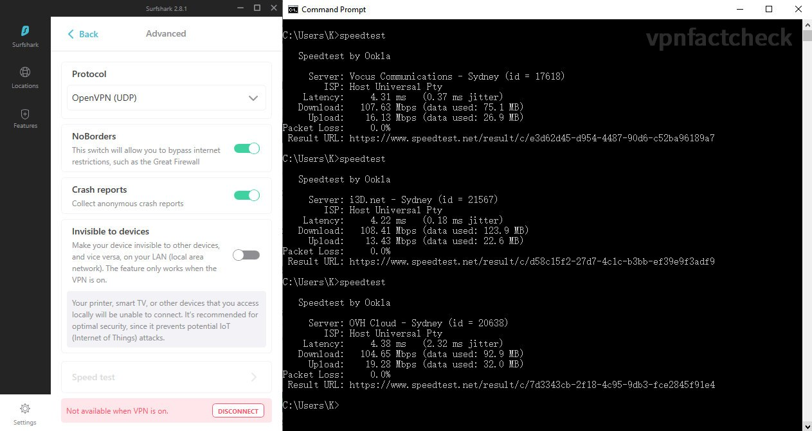
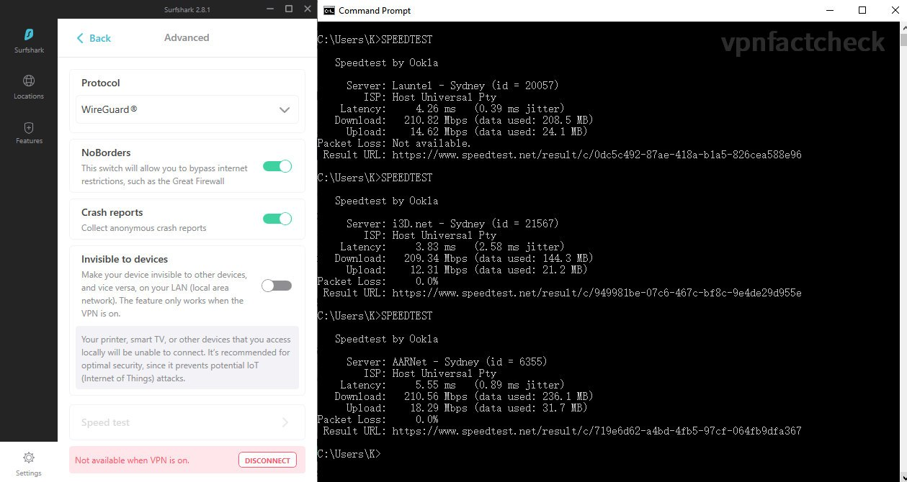

In this test, I am going to find out how fast the [SurfShark](https://surfshark.com/) VPN servers located in Sydney NSW Australia perform. If you are:

* considering to purchase SurfShark VPN or comparing it with other VPNs, or 
* Sydney is your primary VPN destination, 
* you are SurfShark user and want to optimize the VPN connection speed

you shall be interested in this article. 

> It's not an affiliated post.

It's almost guaranteed that 99% of the "SurfShark review" search results on the Internet are affiliated, i.e. the author/website of those will get referral commission paid by the VPN company. Inevitably, conflict of interests arises.

This post is solely a technical test, it's not an affiliated post.

## Sydney VPN Speed Test Setup

If you only care about the results, just jump to results section, though I think the process is also as interesting as the results.

### Network Environment

I am running speed test on NBN 250 plan in Sydney. The fixed broadband speed index of Australia is 75Mbps (ranking 56th globally as the [Global Index from Speedtest.net](https://www.speedtest.net/global-index) ) In this regard I should be grateful that my shoebox city apartment has the optic fibre connection. 

Details of my home network environment:

* Internet: NBN 250/20 ([Tangerine](https://www.tangerinetelecom.com.au) XXXL - Typical Evening Speed 205Mbps)
* Synology RT-2600ac (5Ghz with 160Mhz bandwidth enabled )
* Intel AX200 160Mhz
* Link Speed (Receive/Transmit): 1733/1300 (Mbps)

I wirelessly connect my computer to internet. Since the 160Mhz bandwidth WIFI5 (aka 802.11ac Wave2) offers 1733Mbps link rate, the actual throughput is much over the NBN speed limit so I don't bother to connect it with a LAN wire.

### VPN Speed Test Method

SurfShark offers 5 VPN connection protocols: 

1. IKEv2
2. OpenVPN(TCP)
3. OpenVPN(UDP)
4. ShadowSocks
4. WireGuard

I am interested to find out which of the above offers the fastest connection.

1. Manually select one of the VPN mode: IKEv2 / OpenVPN(TCP) / OpenVPN(UDP) / WireGuard
2. Connect to SurfShark Sydney server with connection mode manually selected
3. Run Ookla speed test in CLI, auto mode (without any parameter settings), run 3 times for each VPN connection mode.

Noted that ShadowSocks only routes the browser traffic and bypass others types of connection, it doesn't fit in our test method run by CLI. Since ShadowSocks is designed for bypassing Internet censoredship or firewall, I think it's OK to leave ShadowSocks alone as most Australians don't require this. 

## Test Results and Conclusion

After running 3 x 5 = 15 times speedtest, hereby below the Sydney SurfShark server speed results:

| SurfShark Sydney | Download Speed | Latency |
|------------------|----------------|---------|
| IKEv2            | 219 Mbps       | 15 ms   |
| OpenVPN-TCP      | 101 Mbps       | 5 ms    |
| OpenVPN-UDP      | 106 Mbps       | 4 ms    |
| WireGuard        | 210 Mbps       | 4 ms    |
| NO VPN           | 233 Mbps       | 3 ms    |

Screenshots of the speedtest results:

| (To zoom in: open the image in new tab) |              |
|:--------------:|:--------------:|
| IKEv2        | OpenVPN(TCP) |
| OpenVPN(UDP) | WireGuard    |

### Is SurfShark Fast in Sydney?

Yes, it's fast enough.

The test speed of the SurfShark's Sydney server reaches 200Mbps, that's three times the Ozzie-average. Actually, 200Mbps is well above the outbound bandwidth of most web/app server threshold, such that 200Mbps is adequate for most VPN users.

For the optimum VPN connection speed, it's suggested to manually select the connection mode in **IKEv2 or WireGuard** mode.

## To Be Improved

This test is not a closed loop. I will look into the below issues in the future articles:

### Speed consistency?

* Will SurfShark speed keep stable throughout the week? Even 365 days?
* Will it drop in the evening when the internet traffic is more congested?

### Compare to the competitors?

How does SurfShark's performance compare to other big names: Nord VPN, Express VPN, Private Internet Access etc...

### Non-speed factors

* Can SurfShark reach Netflix in US, UK ...?
* Is SurfShark safe?

I hope this article helps you. Do not hesitate to left comment if you have anything in mind. Happy to discuss.

Peace.