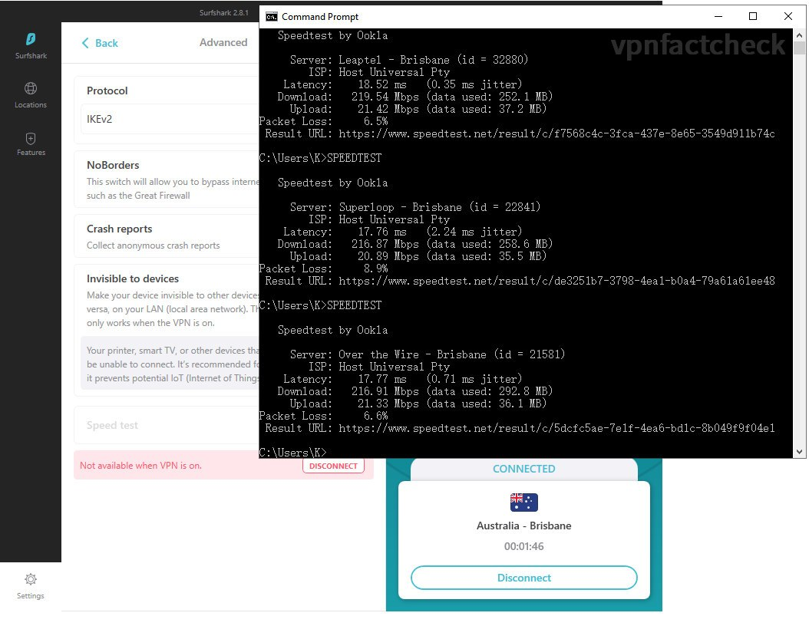
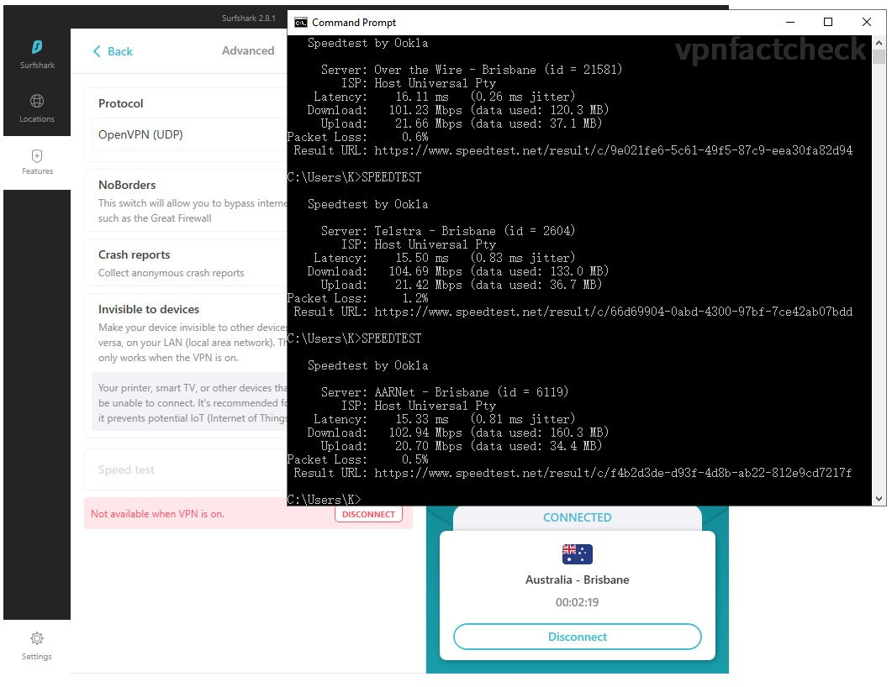
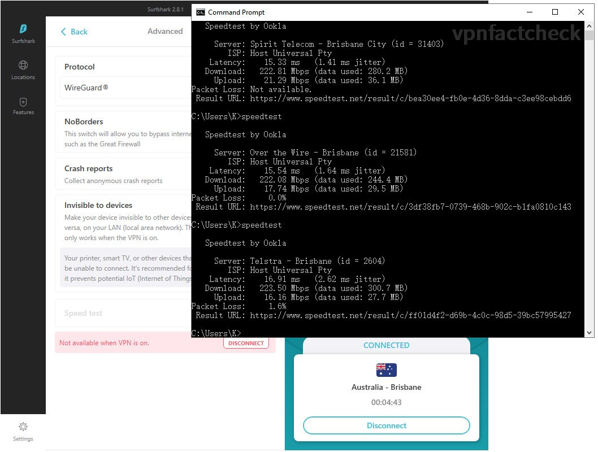

A few days ago I tested [how fast the SurfShark VPN servers located in Sydney](https://karson33.github.io/vpnfactcheck/is-surfshark-fast-in-sydney/), today I will test the SurfShark VPN servers' performance in Brisbane, QLD, Australia. Same as last time, if you are:

* considering to purchase [SurfShark VPN](https://surfshark.com/) or comparing it with other VPNs, or 
* **Brisbane/QLD** is your primary VPN destination, 
* you are SurfShark user and want to optimize the VPN connection speed

you shall be interested in this article. 

## Brisbane VPN Speed Test Setup

The network test setup and method is the same as last time test ([detailed specifications](https://karson33.github.io/vpnfactcheck/is-surfshark-fast-in-sydney/)). In short, I am testing the SurfShark VPN via NBN 250/20 speed plan.

Different from last test to Sydney VPN server, the Brisbane servers are a bit "remote" (I am living in Sydney) - about 1000km away. This physical distance adds a bit latency (ping value) in the test.

Light travels at [300,000km per seconds](https://en.wikipedia.org/wiki/Speed_of_light), it takes at least 3.3ms for a internet traffic travels one way from Sydney to Brisbane, and 6.6ms two-ways. Still, this magnitude of increase in latency is intangible in daily use case. 

### VPN Speed Test Method

Same VPN speed test procedure as [last time](https://karson33.github.io/vpnfactcheck/is-surfshark-fast-in-sydney/), I will run Ookla speedtest to SurfShark four types VPN connection protocols: 

1. IKEv2
2. OpenVPN(TCP)
3. OpenVPN(UDP)
4. WireGuard

## Test Results, Comparison and Conclusion

After running 3 x 4 = 12 times speedtest, hereby below the Brisbane SurfShark VPN server speed results:

| SurfShark Brisbane | Download Speed | Latency |
|------------------|----------------|---------|
| IKEv2            | 218 Mbps       | 18 ms   |
| OpenVPN-TCP      | 100 Mbps       | 20 ms    |
| OpenVPN-UDP      | 102 Mbps       | 15 ms    |
| WireGuard        | 223 Mbps       | 16 ms    |

Compare to Sydney results below, the VPN speed drops due to 1000km distance seems to be insignificant, latency value increases ~10 ms as expected:

| SurfShark Sydney | Download Speed | Latency |
|------------------|----------------|---------|
| IKEv2            | 219 Mbps       | 15 ms   |
| OpenVPN-TCP      | 101 Mbps       | 5 ms    |
| OpenVPN-UDP      | 106 Mbps       | 4 ms    |
| WireGuard        | 210 Mbps       | 4 ms    |
| NO VPN           | 233 Mbps       | 3 ms    |

Screenshots of the VPN speedtest results:

IKEv2        
OpenVPN(TCP)
OpenVPN(UDP)
WireGuard

 

### Is SurfShark Fast in Brisbane?

Yes, it's as fast as in Sydney.

50Mbps is well enough to stream Netflix 4k smoothly so it's safe to say 200Mbps SurfShark speed in Brisbane is fast enough for most internet user. 

For the optimum VPN connection speed, it's suggested to manually select the connection mode in **IKEv2 or WireGuard** mode.

From the Brisbane and Sydney SurfShark speed results, I guess the throughput of SursShark's VPN server is above 210Mbps, however due to the limit of my NBN plan, I could not obtain the maximum value of them (even if I upgrade to 1000Mbps NBN, its typical evening speed is ~300Mbps, so it doesn't give confidence in results).

## Upcoming test

I am interested to know what will be the speed test results for VPN servers in Victoria and Western Australia. I will test those soon.

After that, I will work on speed consistency, unblocking capabilities, safety features and also extend the test to other VPN brands.

I hope this article helps you. Do not hesitate to left comment if you have anything in mind. Happy to discuss.

For more SurfShark VPN tests, please click the "SurfShark" tag; for more performance test to Brisbane local servers, please click the "Brisbane" tag, below the content of the post. 

Peace.