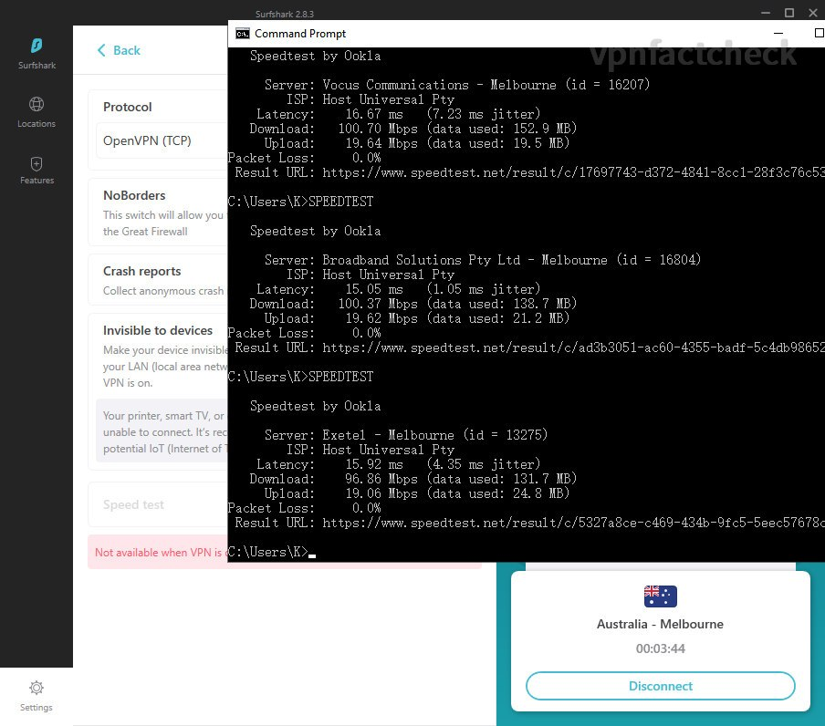

I have tested [how fast the SurfShark VPN servers located in Sydney](https://karson33.github.io/vpnfactcheck/is-surfshark-fast-in-sydney/) and [Brisbane](https://karson33.github.io/vpnfactcheck/how-fast-surfshark-brisbane/) respectively, they both returns over 200Mbps speed test results (in IKEv2 and WireGuard connection protocols). How about SurfShark servers in Melbourn? Let's find it out. As always, if you are:

* considering to purchase [SurfShark VPN](https://surfshark.com/) or comparing it with other VPNs, or 
* **Melbourne/VIC** is your primary VPN destination, 
* you are a SurfShark user and want to optimize the VPN connection speed

you shall be interested in this article. 

## Melbourne VPN Speed Test Setup

The network test setup and method are the same as the previous tests ([detailed specifications](https://karson33.github.io/vpnfactcheck/is-surfshark-fast-in-sydney/)). In short, I am testing the SurfShark VPN via NBN 250/20 speed plan.

The physical distance between Sydney (where I am doing the test) and Melbourne is similar to the distance between Sydney to Brisbane. From the [Brisbane test](https://karson33.github.io/vpnfactcheck/how-fast-surfshark-brisbane/), the latency value increases ~10ms, no big drama still.

### VPN Speed Test Method

Same VPN speed test procedure as [usual](https://karson33.github.io/vpnfactcheck/is-surfshark-fast-in-sydney/), I will run Ookla speedtest to SurfShark four VPN connection protocols: 

1. IKEv2
2. OpenVPN(TCP)
3. OpenVPN(UDP)
4. WireGuard

## Test Results, Comparison and Conclusion

After running 3 x 4 = 12 times speedtest, hereby below the Melbourne SurfShark VPN server speed results:

| SurfShark Melbourne | Download Speed | Latency | Packet Loss |
|------------------|----------------|---------|---------|
| IKEv2            | 217 Mbps       | 16 ms   | 4% |
| OpenVPN-TCP      | 99 Mbps       | 16 ms    | 0% |
| OpenVPN-UDP      | 94 Mbps       | 16 ms    | 0% |
| WireGuard        | 221 Mbps       | 15 ms    | 1% |

<mark>WireGuard</mark> seems to the champ of the four VPN protocols that SurfShark offers in Melbourn servers, it provides the **fastest** speed throughput and relatively **low packet loss**.

Screenshots of the VPN speedtest results:

IKEv2        
OpenVPN(TCP)
OpenVPN(UDP)
WireGuard

For comparison, [tests on SurfShark Sydney servers](https://karson33.github.io/vpnfactcheck/is-surfshark-fast-in-sydney/) are snippet as below, packet loss in all cases are ~0% I think due to close in the physical distance (I live in Sydney when doing the tests):

| SurfShark Sydney | Download Speed | Latency |
|------------------|----------------|---------|
| IKEv2            | 219 Mbps       | 15 ms   |
| OpenVPN-TCP      | 101 Mbps       | 5 ms    |
| OpenVPN-UDP      | 106 Mbps       | 4 ms    |
| WireGuard        | 210 Mbps       | 4 ms    |
| NO VPN           | 233 Mbps       | 3 ms    |

 

### How Fast is SurfShark VPN in Melbourne VIC?

It's confident to conclude that the fastest SurfShark VPN server in Melbourne (WireGuard mode) can offer a connection speed of **over 200Mbps**. However, I am unable to find what is the performance ceiling of the SurfShark VPN server since my NBN plan is only 250/20. Even if I upgrade to 1000Mbps NBN, its typical evening speed is ~300Mbps, so it doesn't give confidence in the results. 

Nevertheless, 200Mbps is **fast enough** for most internet users. 

## Upcoming tests

Besides the yet-to-be-tested VPN server locations in Australia - Perth and Adelaide, I have several testing ideas in my mind:

* speed consistency - 24hr stability, 365 days stability 
* connection speed from Australia to America, Europe, Asia etc.
* unblocking capabilities - e.g. Netflix
* safety features

I am not limiting the test to SurfShark only, I will purchase more VPN services for testing purpose. 

I'd love to <mark>hear from the community</mark> what tests you would like to see, which brand you like me to test, etc. 

I hope this article helps you. Do not hesitate to left comments if you have anything in mind. Happy to discuss.

Peace.