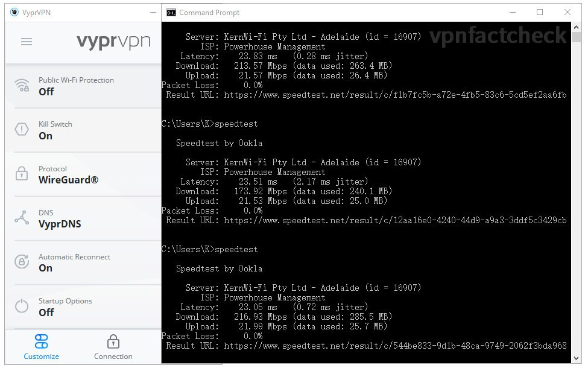
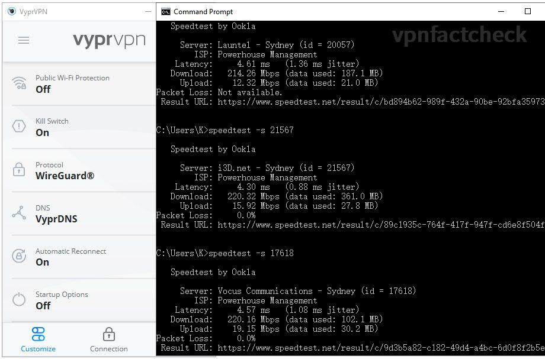
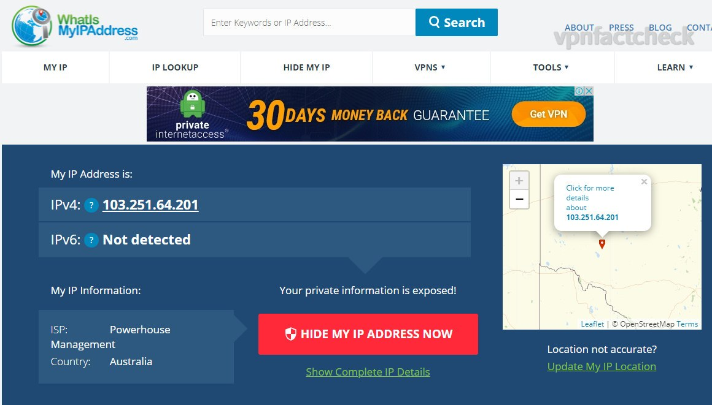
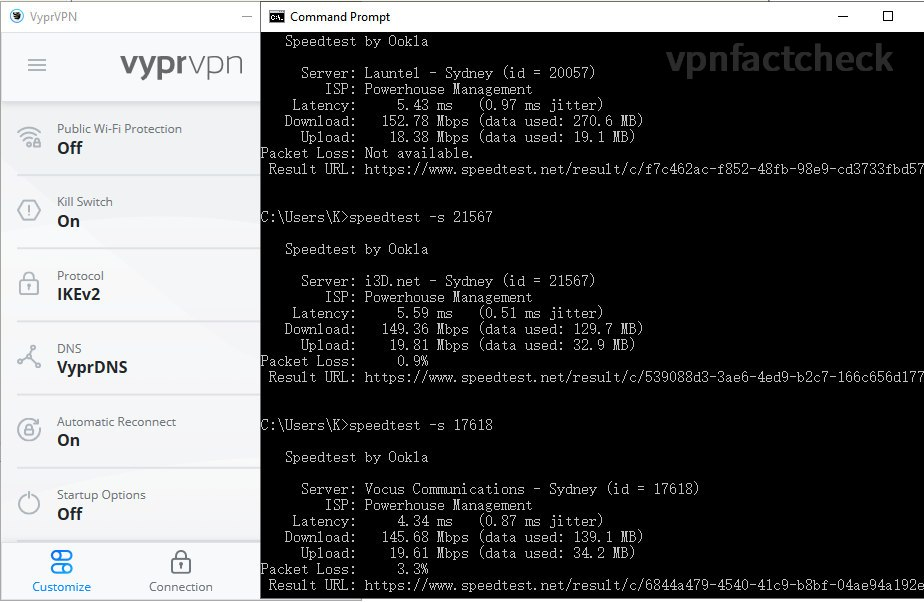
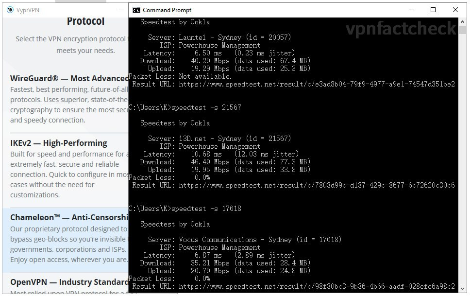
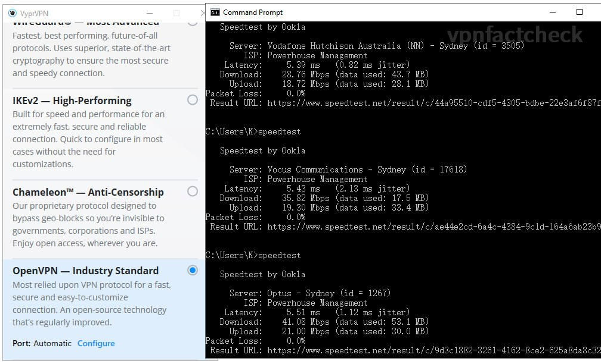

Previously I have tested [SurfShark VPN speed performance with regards its servers in Sydney](https://karson33.github.io/vpnfactcheck/is-surfshark-fast-in-sydney/). In this test, I am going to find out how fast the [VyprVPN](https://vyprvpn.com/) Sydney servers are. If you are:

* considering to purchase VyprVPN or comparing it with other VPNs, or 
* Sydney is your primary VPN destination, 
* you are a VyprVPN user and want to optimize the VPN connection speed (the findings in this test will help you double or triple your VPN connection speed)

then the test data in this article is valuable to your decision.

## Sydney VPN Speed Test Setup

If you only care about the results, just jump to results section, though I think the process is also as interesting as the results. The test setup for VyprVPN testing is the same as for SurfShark.

### Network Environment

I am running speed test on NBN 250 plan in Sydney. The fixed broadband speed index of Australia is 75Mbps (ranking 56th globally as the [Global Index from Speedtest.net](https://www.speedtest.net/global-index) ) In this regard I should be grateful that my shoebox city apartment has the optic fibre connection. 

Details of my home network environment:

* Internet: NBN 250/20 ([Tangerine](https://www.tangerinetelecom.com.au) XXXL - Typical Evening Speed 205Mbps)
* Synology RT-2600ac (5Ghz with 160Mhz bandwidth enabled )
* Intel AX200 160Mhz
* Link Speed (Receive/Transmit): 1733/1300 (Mbps)

I wirelessly connect my computer to internet. Since the 160Mhz bandwidth WIFI5 (aka 802.11ac Wave2) offers 1733Mbps link rate, the actual throughput is much over the NBN speed limit so I don't bother to connect it with a LAN wire.

### VPN Speed Test Method

VyprVPN offers 5 VPN connection protocols: 

1. WireGuard
2. IKEv2
3. Chameleon - Anti-Censorship
4. OpenVPN

I am interested to find out which of the above offers the fastest connection. Hereby below the test procedures:

1. Manually select one of the VPN mode: IKEv2 / OpenVPN / Chameleon / WireGuard
2. Connect to VyprVPN Sydney server with connection mode manually selected
3. Run Ookla speed test in CLI, auto mode (without any parameter settings), run 3 times for each VPN connection mode.

### Unexpected Speedtest Auto Location

The [speedtest-cli](https://www.speedtest.net/apps/cli) claims that it will automatically set the closest and fastest server for speed test. However, when I connected to VyprVPN Sydney and hit "speedtest", the app automatically chose test servers in Adelaide: 

The ping values were over 20ms indicates that it might not be a Sydney server. I then manually set test servers to those in Sydney, then the ping value drops to below 5ms: 

I think it's due to the IP geolocation database discrepancy. I study the code of [speedtest-cli](https://github.com/sivel/speedtest-cli), the test server API returns list of server according to your requesting IP address. 

## Test Results and Conclusion

After running 3 x 5 = 15 times speedtest, hereby below the Sydney VyprVPN server speed results:

| SurfShark Sydney | Download Speed | Latency | Packet Loss |
|------------------|----------------|---------|---------|
| WireGuard             | 216 Mbps       | 4 ms   | 0% |
| IKEv2     | 149 Mbps       | 5 ms    | 2.1% |
| Chameleon      | 41 Mbps       | 8 ms    | 0% |
| OpenVPN        | 35 Mbps       | 5 ms    |0% |
| NO VPN           | 233 Mbps       | 3 ms    |0% |

Significant difference was found between VyprVPN's 4 VPN connection protocols - the fastest WireGuard is 6 times faster than the slowest OpenVPN. 

Screenshots of the speedtest results:

| (To zoom in: open the image in new tab) |              |
|:--------------:|:--------------:|
| IKEv2        | Chameleon |
| OpenVPN | WireGuard    |

### Is VyprVPN Fast in Sydney?

If your device supports **WireGuard** or **IKEv2** protocol, then VyprVPN is fast enough for daily internet usage.

However, if your device supports only OpenVPN, then VyprVPN's speed won't satisfy you. Other VPN can do better. I tested SurfShark VPN previously and hereby below results for comparison: 

| SurfShark Sydney | Download Speed | Latency |
|------------------|----------------|---------|
| IKEv2            | 219 Mbps       | 15 ms   |
| OpenVPN-TCP      | 101 Mbps       | 5 ms    |
| OpenVPN-UDP      | 106 Mbps       | 4 ms    |
| WireGuard        | 210 Mbps       | 4 ms    |
| NO VPN           | 233 Mbps       | 3 ms    |

SurfShark VPN's OpenVPN is 3 times faster than VyprVPN's.

Having said that, I think seldom computer and mobile support only OpenVPN. It only happens to me that wireless router and Linux-operated devices has limited support to IKEv2 and WireGuard.

## Keep posted

I hope this article helps you. Do not hesitate to left comment if you have anything in mind. Happy to discuss.

I will keep posted on [Twitter](https://twitter.com/vpnfactcheck) when I completed the below tests in the furture:

* Speedtest to other Australian servers
* Speedtest to oversea servers
* Will VyprVPN speed keep stable throughout the week? Even 365 days?
* Will it drop in the evening when the internet traffic is more congested?
* Can VyprVPN unblock Netflix in US, UK ...?
* Is VyprVPN safe?

Peace.