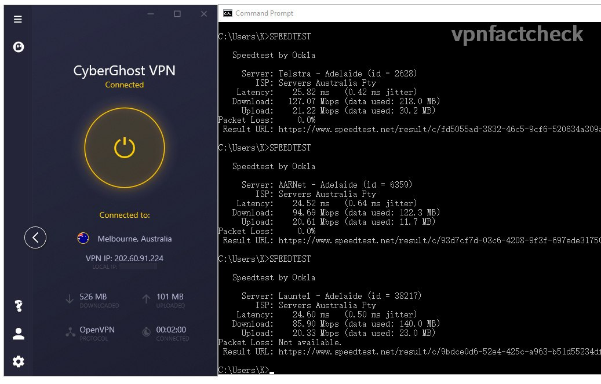
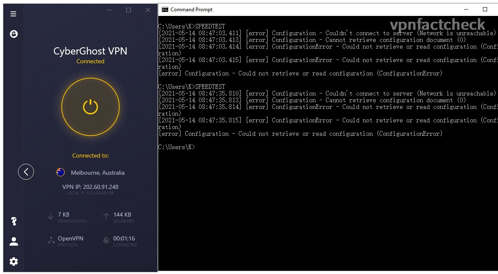

Previously I have tested [SurfShark VPN speed performance on its servers in Melbourne](https://karson33.github.io/vpnfactcheck/SurfShark-melbourne-server-tested/). In this test, I am going to find out how fast the [Cyberghost VPN](https://www.cyberghostvpn.com/) Melbourne servers are. If you are:

* considering to purchase CyberGhost or comparing it with other VPNs, or 
* Melbourne is your primary VPN destination, 
* you are a CyberGhost user and want to optimize the VPN connection speed (the findings in this test will help you double or triple your VPN connection speed)

then the test data in this article is valuable to your decision.

## Melbourne VPN Speed Test Setup

If you only care about the results, just jump to the results section, though I think the process is also as interesting as the results. The test setup for CyberGhost testing is the same as for SurfShark.

### Network Environment

I am running speed tests on NBN 250 plan in Sydney. The fixed broadband speed index of Australia is 75Mbps (ranking 56th globally as the [Global Index from Speedtest.net](https://www.speedtest.net/global-index) ) In this regard I should be grateful that my shoebox city apartment has the optic fibre connection. 

Details of my home network environment:

* Internet: NBN 250/20 ([Tangerine](https://www.tangerinetelecom.com.au) XXXL - Typical Evening Speed 205Mbps)
* Synology RT-2600ac (5Ghz with 160Mhz bandwidth enabled )
* Intel AX200 160Mhz
* Link Speed (Receive/Transmit): 1733/1300 (Mbps)

I wirelessly connect my computer to the internet. Since the 160Mhz bandwidth WIFI5 (aka 802.11ac Wave2) offers 1733Mbps link rate, the actual throughput is much over the NBN speed limit so I don't bother to connect it with a LAN wire.

### VPN Speed Test Method

CyberGhost offers 3 VPN connection protocols: 

1. WireGuard
2. IKEv2
3. OpenVPN

I am interested to find out which of the above offers the fastest connection. Hereby below the test procedures:

1. Manually select one of the VPN modes: IKEv2 / OpenVPN / WireGuard
2. Connect to CyberGhost Melbourne server with connection mode manually selected
3. Run Ookla speed test in CLI, auto mode (without any parameter settings), run 3 times for each VPN connection mode.

### Unexpected Speedtest Auto Location

The [speedtest-cli](https://www.speedtest.net/apps/cli) claims that it will automatically set the closest and fastest server for speed test. It works fine with CyberGhost's IKEv2 and WireGuard VPN protocol. However, when I connected to CyberGhost Melbourne in **OpenVPN mode**, the speedtest app automatically chose test servers in Adelaide: 

The ping values were over 25ms, slightly higher than the ping values with the Melbourne target server. I then manually set test servers to those in Melbourne and retested: 

It's not that far away from Adelaide and Melbourne, unsurprisingly the results were close.

Noted that in one occasion of OpenVPN connection to CyberGhost Melbourne, the connection to the internet failed and I need to disconnect and reconnect:

  

---
## Test Results and Conclusion

After running 3 x 3 = 9 times speedtest, hereby below the Melbourne CyberGhost server speed results:

| CyberGhost Melbourne | Download Speed | Latency | Packet Loss |
|------------------|----------------|---------|---------|
| WireGuard             | 200 Mbps       | 15 ms   | 0% |
| IKEv2     | 193 Mbps       | 25 ms    | 0% |
| OpenVPN        | 78 Mbps       | 15 ms    |0% |
| NO VPN           | 233 Mbps       | 3 ms    |0% |

Among the three CyberGhost VPN protocols - WireGuard and IKEv2 touch 200Mbps, the slowest OpenVPN can still offer 80~100Mbps. The zero packet loss rate in WireGuard is amazing. Previously tests on SurfShark and VyprVPN neither of them returns absolute 0% loss in WireGuard (the fastest) connection mode.

Screenshots of the speedtest results:

| (To zoom in: open the image in new tab) |              |
|:--------------:|:--------------:|
| IKEv2        | WireGuard 
| OpenVPN |    |
|  |              |

### Is CyberGhost VPN Fast in Melbourne?

If your device supports **WireGuard** or **IKEv2** protocol, then CyberGhost is fast enough for daily internet usage. If your device supports only OpenVPN, CyberGhost can still keep you smooth surfing but don't overload it with multiple 4k-streaming etc. 

Unlike SurfShark and VyprVPN, **CyberGhost** lists out its every servers in Melbourne. Thumbs up for its transparency - it gives you a clear idea of how many servers (and $$$) they have invested to serve the **Melbourne** community. 

## Keep posted

I hope this article helps you. Do not hesitate to left comments if you have anything in mind. Happy to discuss.

I will keep posted on [Twitter](https://twitter.com/vpnfactcheck) when I completed the below tests in the future:

* Speedtest to other Australian servers
* Speedtest to oversea servers
* Will CyberGhost VPN speed keep stable throughout the week? Even 365 days?
* Will it drop in the evening when the internet traffic is more congested?
* Can CyberGhost unblock Netflix in US, UK ...?
* Is CyberGhost safe?

Peace.