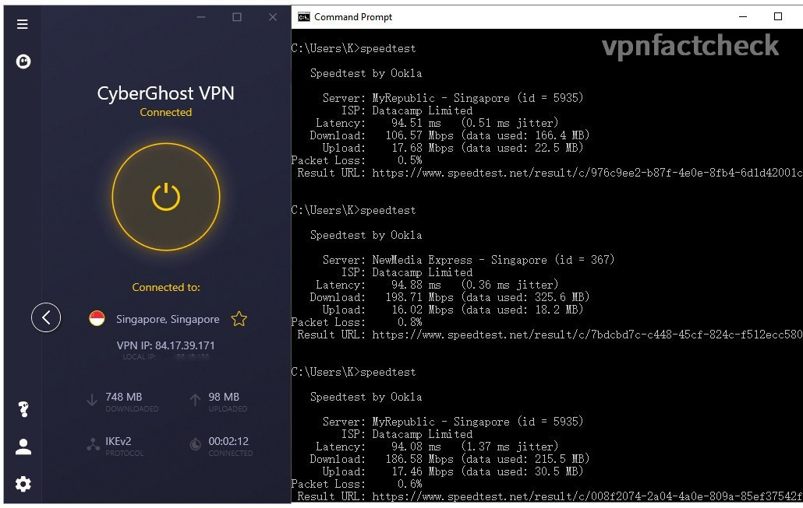
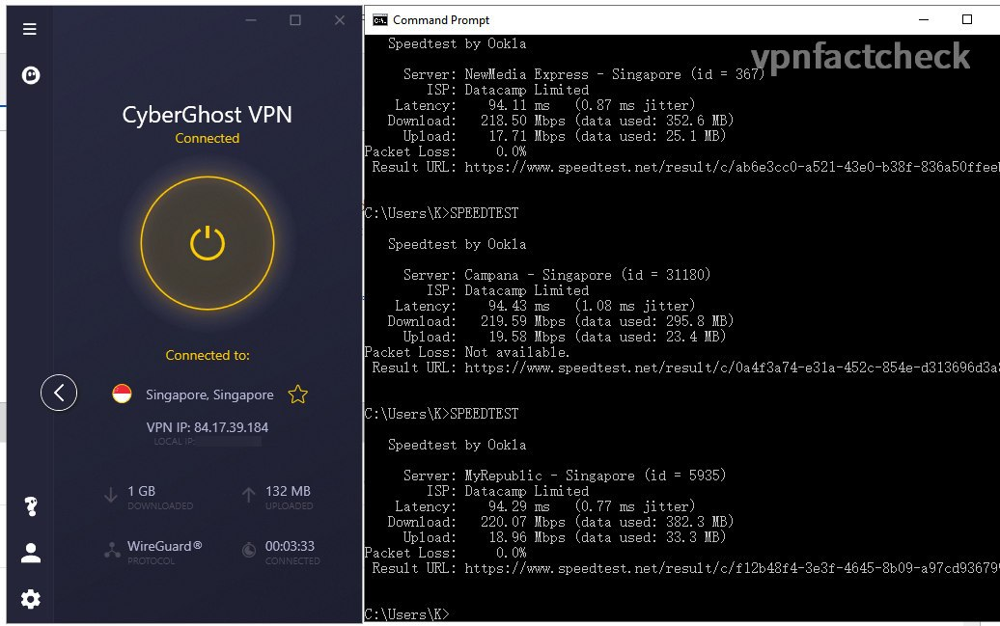
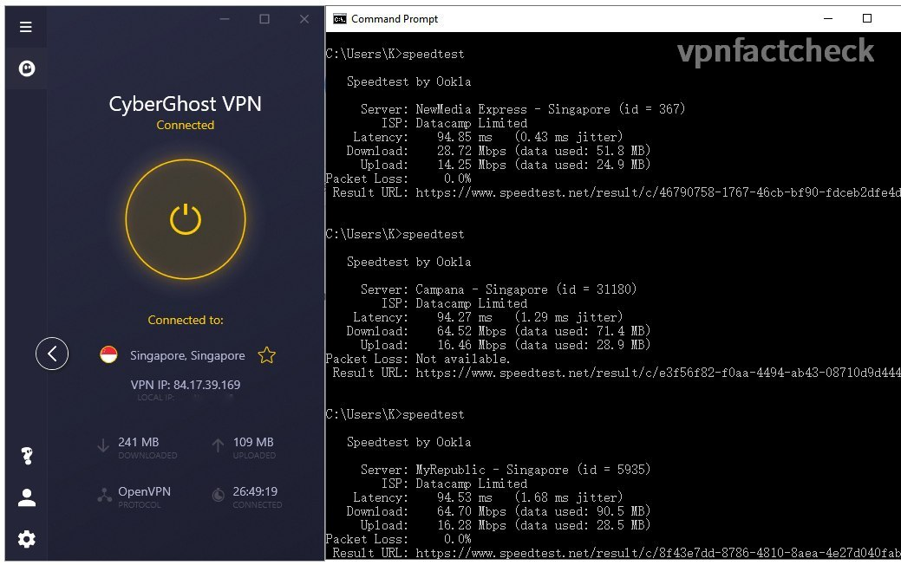

It's my first oversea VPN speedtest from Sydney Australia. Previously I have tested [CyberGhost VPN speed performance on its servers in Melbourne](https://karson33.github.io/vpnfactcheck/cyberghost-vpn-to-singapore-speedtested/). In this test, I am going to find out how fast the [Cyberghost VPN](https://www.cyberghostvpn.com/) Singapore servers are (from Australia). If you are:

* considering to purchase CyberGhost or comparing it with other VPNs, or 
* Singapore is your primary VPN destination, 
* you are a CyberGhost user and want to optimize the VPN connection speed (the findings in this test will help you double or triple your VPN connection speed)

then the test data in this article is valuable to your decision.

## Singapore VPN Speed Test Setup

If you only care about the results, just jump to the results section, though I think the process is also as interesting as the results. The test setup for CyberGhost testing is the same as for SurfShark.

### Network Environment

I am running speed tests on NBN 250 plan in Sydney. The fixed broadband speed index of Australia is 75Mbps (ranking 56th globally as the [Global Index from Speedtest.net](https://www.speedtest.net/global-index) ) In this regard I should be grateful that my shoebox city apartment has the optic fibre connection. 

Details of my home network environment:

* Internet: NBN 250/20 ([Tangerine](https://www.tangerinetelecom.com.au) XXXL - Typical Evening Speed 205Mbps)
* Synology RT-2600ac (5Ghz with 160Mhz bandwidth enabled )
* Intel AX200 160Mhz
* Link Speed (Receive/Transmit): 1733/1300 (Mbps)

I wirelessly connect my computer to the internet. Since the 160Mhz bandwidth WIFI5 (aka 802.11ac Wave2) offers 1733Mbps link rate, the actual throughput is much over the NBN speed limit so I don't bother to connect it with a LAN wire.

### VPN Speed Test Method

CyberGhost offers 3 VPN connection protocols: 

1. WireGuard
2. IKEv2
3. OpenVPN

I am interested to find out which of the above offers the fastest connection. Hereby below the test procedures:

1. Manually select one of the VPN modes: IKEv2 / OpenVPN / WireGuard
2. Connect to CyberGhost Singapore server with connection mode manually selected
3. Run Ookla speed test in CLI, auto mode (without any parameter settings), run 3 times for each VPN connection mode.

### Distance Matters - but to what extend?

Singapore is 6500km away from Sydney Australia, light / internet traffic in optic fibre travels ~300,000km/s, that means it takes at least 22ms for a packet to travel from Sydney to Singapore, and 44ms round trip. An increase in latency is expected.

But how about speed in Mbps? Would it be impacted by the long distance? This test is about to find out.

---
## Test Results and Conclusion

After running 3 x 3 = 9 times speedtest with VPN on, hereby below the Singapore CyberGhost server speed results:

| CyberGhost Singapore | Download Speed | Latency | Packet Loss |
|------------------|----------------|---------|---------|
| WireGuard             | 219 Mbps       | 94 ms   | 0% |
| IKEv2     | 163 Mbps       | 94 ms    | 2.1% |
| OpenVPN        | 52.3 Mbps       | 94 ms    |0% |
| NO VPN           | 233 Mbps       | 3 ms    |0% |

CyberGhost WireGuard VPN connection clearly takes the lead of the three VPN protocols (in terms of speed at least). So if you are a CyberGhost VPN user, try setting the VPN protocol in WireGuard (instead of auto default).

Screenshots of the speedtest results:

| (To zoom in: open the image in new tab) |              |
|:--------------:|:--------------:|
| IKEv2        | WireGuard 
| OpenVPN |    |
|  |              |

### Is CyberGhost VPN Fast in Singapore?

If your device supports **WireGuard** protocol, then CyberGhost is fast enough for daily internet usage. If your device supports only OpenVPN, CyberGhost can still keep you smooth surfing but don't overload it with multiple 4k-streaming etc. 

Unlike SurfShark and VyprVPN, **CyberGhost** lists out its every server in Singapore. Thumbs up for its transparency - it gives you a clear idea of how many servers (and $$$) they have invested in Singapore.

One interesting finding is that the distance in geolocation doesn't impact much on the test speed, amid the latency did increase as expected. Maybe next time I will take a further step to test the VPN connection from Australia to the United States - the opposite of the globe, to see what happens.

## Keep posted

I hope this article helps you. Do not hesitate to left comments if you have anything in mind. Happy to discuss.

I will keep posted on [Twitter](https://twitter.com/vpnfactcheck) when I completed the below tests in the future:

* Similar tests to other oversea countries
* Similar tests on other VPNs
* Test on unblocking capability of Netflix etc.

Peace.