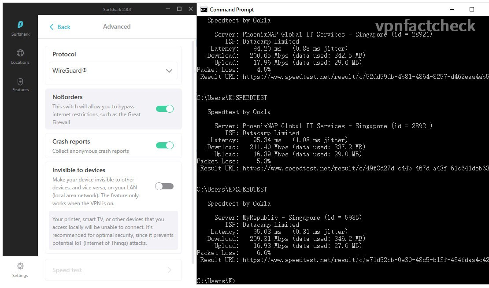

Following up to the previous test to Singapore VPN servers of CyberGhost [CyberGhost VPN - Connection to Singapore Speedtested](https://karson33.github.io/vpnfactcheck/cyberghost-vpn-to-singapore-speedtested/). In this test, I am going to find out how fast the [SurfShark VPN](https://surfshark.com/) Singapore servers are (from Australia). If you are:

* considering to purchase SurfShark or comparing it with other VPNs, or 
* Singapore is your primary VPN destination, 
* you are a SurfShark user and want to optimize the VPN connection speed (the findings in this test will help you double or triple your VPN connection speed)

then the test data in this article is valuable to your decision.

## Singapore VPN Speed Test Setup

If you only care about the results, just jump to the results section, though I think the process is also as interesting as the results. The test setup for CyberGhost testing is the same as for SurfShark.

### Network Environment

I am running speed tests on NBN 250 plan in Sydney. The fixed broadband speed index of Australia is 75Mbps (ranking 56th globally as the [Global Index from Speedtest.net](https://www.speedtest.net/global-index) ) In this regard I should be grateful that my shoebox city apartment has the optic fibre connection. 

Details of my home network environment please refer to [my previous post](https://karson33.github.io/vpnfactcheck/cyberghost-vpn-to-singapore-speedtested/)

### VPN Speed Test Method

SurfShark offers 5 VPN connection protocols: 

1. WireGuard
2. IKEv2
3. OpenVPN(TCP)
4. OpenVPN(UDP)

Plus the anti-censorship-firewall ShadowSocks which is popular in area like China. But we are not testing ShadowSocks since Singapore is not a "firewalled" country.

I am interested to find out which of the above offers the fastest connection. Hereby below the test procedures:

1. Manually select one of the VPN modes: IKEv2 / OpenVPN(TCP&UDP) / WireGuard
2. Connect to SurfShark Singapore server with connection mode manually selected
3. Run Ookla speed test in CLI, auto mode (without any parameter settings), run 3 times for each VPN connection mode.

### Distance Matters - to latency but not to throughput

In my previous [test on CyberGhost's Singapore servers](https://karson33.github.io/vpnfactcheck/cyberghost-vpn-to-singapore-speedtested/), it was found that the geo-distance between Sydney and Singapore induces quite a jump in latency (to 90ms) but didn't show a obvious decrease on throughput. 

---
## Test Results and Conclusion

After running 3 x 4 = 12 times speedtest with VPN on, hereby below the Singapore CyberGhost server speed results:

| SurfShark Singapore | Download Speed | Latency | Packet Loss |
|------------------|----------------|---------|---------|
| WireGuard             | 203 Mbps       | 94 ms   | 6% |
| IKEv2     | 200 Mbps       | 94 ms    | 11% |
| OpenVPN (TCP) | 13 Mbps       | 94 ms    |0% |
| OpenVPN (UDP) | ERROR       | -    | - |
| NO VPN           | 233 Mbps       | 3 ms    |0% |

I couldn't obtain the OpenVPN(UDP) results due to repeated speedtest error. I could only obtain one result for reference from all other failed trials:

SurfShark's Singapore servers offer the best performance with WireGuard protocol. Although the IKEv2 protocol gives similar throughput, but hte packet loss rate is surprisingly high - 11%. I definitely would opt for WireGuard mode if my device supports it.

Screenshots of the speedtest results:

| (To zoom in: open the image in new tab) |              |
|:--------------:|:--------------:|
| IKEv2        | WireGuard 
| OpenVPN-TCP |    |
|  |              |

### How Fast is SurfShark VPN in Singapore?

It depends on what VPN protocol. If your device supports **WireGuard** protocol, then Surfshark is fast and stable. IKEv2 is still OK but the high packet loss rate concerns me. OpenVPN is a big NO-GO for SurfShark. 

## Keep posted

I hope this article helps you. Do not hesitate to left comments if you have anything in mind. Happy to discuss.

I will keep posted on [Twitter](https://twitter.com/vpnfactcheck) when I completed the below tests in the future:

* Similar tests to other oversea countries
* Similar tests on other VPNs
* Test on unblocking capability of Netflix etc.

Peace.